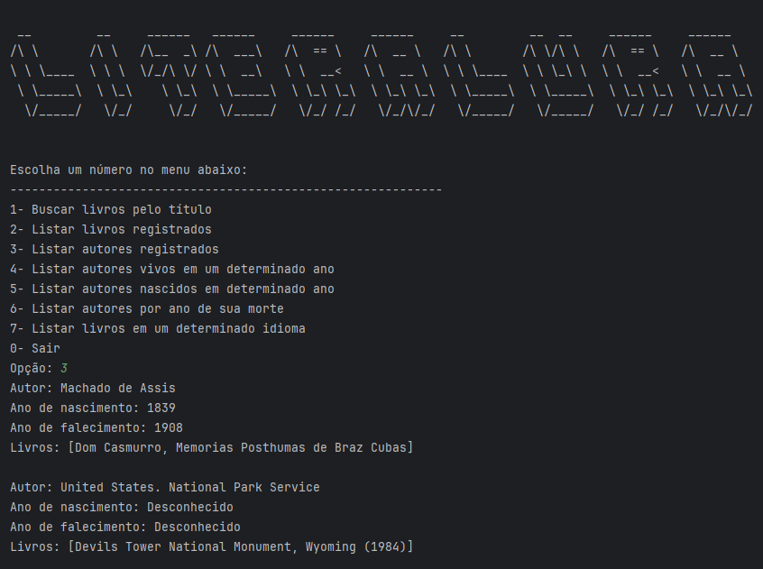

# 📚Literalura&#x20;

**Literalura** é uma aplicação Java/Spring Boot para pesquisa de livros desenvolvida como parte de um Challenge do programa Alura ONE.
O projeto tem como objetivo solidificar os conhecimentos em consumo de APIs e persistência de dados.
Esta aplicação permite buscar livros, listar livros registrados, listar autores, e muitas outras funcionalidades relacionadas à leitura e organização de livros.

---

## Funcionalidades

- **Buscar livros pelo título**: Consulta a API Gutendex para buscar livros pelo título.
- **Listar livros registrados**: Exibe todos os livros registrados no banco de dados.
- **Listar autores registrados**: Exibe todos os autores dos livros registrados.
- **Listar autores vivos em um determinado ano**: Lista autores que estavam vivos em um ano especificado.
- **Listar autores nascidos em determinado ano**: Lista autores que nasceram em um ano especificado.
- **Listar autores por ano de sua morte**: Lista autores que morreram em um ano especificado.
- **Listar livros em um determinado idioma**: Lista livros registrados no banco de dados em um idioma especificado.
- **Encerrar a aplicação**: Encerra o programa.

---

## Tecnologias Utilizadas

- Java 21
- Spring Boot
- Hibernate
- PostgreSQL
- Gutendex API
- Maven

---

## Configuração do Projeto

### Pré-requisitos

- Java 21
- Maven
- PostgreSQL

### Instalação

Clone o repositório:

```bash
git clone https://github.com/seu-usuario/literalura.git
cd literalura
```

Configure o banco de dados no arquivo `application.properties`:

```properties
spring.datasource.url=jdbc:postgresql://localhost:5432/literalura
spring.datasource.username=seuUsuario
spring.datasource.password=suaSenha
spring.jpa.hibernate.ddl-auto=update
spring.jpa.show-sql=true
```

Execute o projeto:

```bash
mvn spring-boot:run
```

---

## Estrutura do Projeto

```
br.com.alura.literalura
├─ principal      # Classe Principal que gerencia a execução da aplicação
├─ model          # Classes de modelo (Book, Author, BookDto, AuthorDto)
├─ repository     # Interfaces de repositório Spring Data JPA
└─ service        # Classes de serviço (ConsumoAPI, ConverteDados)
```

---

## Uso

Ao iniciar a aplicação, o menu principal será exibido com as opções disponíveis. Basta seguir as instruções na tela para navegar pelas funcionalidades.

### Exemplo de Uso

- **Buscar livros pelo título**

  1. Digite `1` e pressione Enter.
  2. Insira o título do livro que deseja buscar.
  3. A aplicação fará uma consulta à API Gutendex e exibirá os resultados.

- **Listar livros registrados**\
  Digite `2` e pressione Enter para listar todos os livros registrados.

- **Listar autores registrados**\
  Digite `3` e pressione Enter para listar todos os autores.

- **Listar autores vivos em um determinado ano**\
  Digite `4` e pressione Enter, depois insira o ano desejado.

- **Listar autores nascidos em determinado ano**\
  Digite `5` e pressione Enter, depois insira o ano desejado.

- **Listar autores por ano de sua morte**\
  Digite `6` e pressione Enter, depois insira o ano desejado.

- **Listar livros em um determinado idioma**\
  Digite `7` e pressione Enter, depois insira o código do idioma (`en` para Inglês, `pt` para Português, etc.).

- **Encerrar a aplicação**\
  Digite `0` e pressione Enter.

---

## Licença

Este projeto está licenciado sob a **[MIT License](LICENSE)**. Veja o arquivo LICENSE para mais detalhes.

---

## Imagem da aplicação em funcionamento

